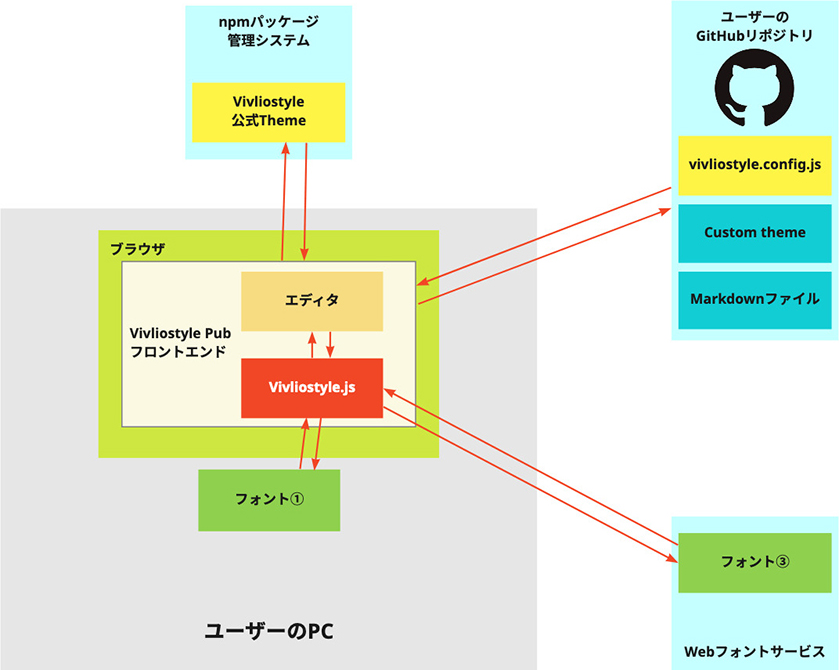

# Vivliostyle Pubがフォントを扱う仕組み

小形克宏（一般社団法人ビブリオスタイル理事）

## はじめに

Vivliostyle Pub[^1]は、「誰でもCSS組版を楽しめるプロダクト」を目指して開発されたWebアプリだ。面倒なインストールやコマンドラインによる操作は不要、ネットに{繫|つな}がったブラウザさえあれば、誰でも無料でCSS組版による本作りができる。一昨年から開発が進められてきたが、ようやく今年4月にアルファ版を公開するところまできた。まだまだ開発途中ではあるが、一人でも多くのユーザーに使っていただき、可能ならフィードバックしてもらえるとありがたい[^2]。

{width=400}

さて、そのVivliostyle Pubだが、組版エンジン（Vivliostyle.js[^3]）がプレビュー用はローカル、PDF出力用はクラウドという具合いに、別々の場所に実装されている。その仕組みは後述するが、こうした理由はプレビュー表示を、少しでも早くしたかったからだ[^4]。

ところが、組版エンジンを分離させた結果、ユーザーが意識しないままプレビューとPDF出力とでフォントが食い違うことが起こり得るようになった。もし両者のフォントが違えば、プレビューとPDF出力とで行数やページ数が違ってしまう。

とはいえ、食い違ったと言っても、それはCSSにおける`font-family`や、Linuxにおけるfontconfigの指定によりフォールバックした結果であり、相似のフォントで代替させる既定の動作にすぎない。それでも、同人誌印刷では1ページ違えば印刷料金が変わることもある。プレビューとPDF出力でページが異なることが分かれば、ユーザーはVivliostyle Pubに不信感を抱くだろう。

この問題はいずれ解決するべきとは思うが、アーキテクチャの深い部分に関わるものであり、すぐには無理と思われる。本稿ではVivliostyle Pubがどのようにフォントを扱っているのかを説明する。これによりユーザーの混乱を少しでも防ぎ、より多くの人にVivliostyle Pubを使ってもらえればと思う。少しの間、お付き合いいただければ幸いだ。

なお、本稿の内容は、筆者が主に担当した「Vivliostyle Pubユーザーガイド」[^5]の一部を、読み物として再構成したものであることをお断りしておく。より深く理解するために、対応するユーザーガイドのセクションを〈　〉で示した。それから、本稿はVivliostyle Pubで執筆した[^6]。

## フォントを指定する方法

まず、Vivliostyle Pubではどのようにしてフォントや文字サイズを指定するのだろうか。残念ながら、既存ワードプロセッサのようにテキストを選択し、その部分のフォントや文字サイズを指定するようなGUIはまだなく[^7]、別途スタイルシートの中でそれらを指定するという間接的な方法をとっている。利用できるスタイルシートは下記の3種類だ。

1. **Plain theme：**ブラウザのデフォルトスタイルシートにもとづく必要最低限のもの
2. **Vivliostyle公式theme：**npmパッケージとして公開されているスタイルシート[^8]
3. **Custom theme：**ユーザーが自分で書いたCSSスタイルシート

いずれもActionメニューと呼ばれるプルダウンメニューの中から選択／切り替えができる〈Actionメニューの機能 > Theme（スタイル情報の選択）[^9]〉。

上記1で使用されるフォントは、使っているブラウザで設定されたデフォルトフォントだ。ただしPlain themeは手っ取り早くプレビューを確認するためのもので、出力はあまり想定していない。

上記2のVivliostyle公式themeで指定されている`font-family`は下記の通りだ。

- Book theme for latin font……`Georgia, serif;`[^10]
- 文庫用のテーマ……`"游明朝", "YuMincho", serif;`[^11]
- Slide theme……`'Noto', 'YuGothic', 'Yu Gothic', 'Meiryo', sans-serif;`[^12]
- Techbook (技術同人誌) theme……`'Neue Frutiger World', 'Verdana',  'Hiragino Sans', sans-serif;`[^13]
- Academic theme……`'Hiragino Mincho ProN', serif;`[^14]

## 利用可能なフォントとそれらを扱う仕組み

Vivliostyle Pubが扱えるフォントは、フォントがおかれた場所ごとに以下の3種類に分別できる。〈文書の作成と保存 > フォントの指定方法[^15]〉

- ユーザーのPCにあるローカルフォント（**フォント1**）
- クラウドにインストールされたフォント（**フォント2**）
- Webフォントサービスのフォント（**フォント3**）

上記のうち**フォント2**のリストはユーザーガイド〈文書の作成と保存 > フォントに関する補足情報 > **クラウドにインストールされているフォント一覧**[^16]〉にまとめてある。詳しくはそちらを見ていただくとして、簡単に言うとNoto fonts[^17]とMicrosoft TrueType core fonts[^18]、およびLinuxの標準的なフォントセットだ。

それでは、上記3種類のフォントを使って、Vivliostyle Pubはどのようにしてプレビューしたり、PDF出力したりしているのだろう。まずプレビューの仕組みから見てみよう（図2）。

{width=400}

プレビューのために実際に組版をおこなうのが、中央にあるVivliostyle.jsであり、これはユーザーのPC上のフロントエンドにある。したがって同じユーザーのPC上にある**フォント1**、そしてネットを介して利用可能なWebフォントサービスの**フォント3**がプレビューで利用できるわけだ。

他方、クラウドにインストールされた**フォント2**はこの図では見当たらない。フロントエンドにあるVivliostyle.jsはクラウド上のフォントにアクセスする手段がないからだ。つまりプレビューでは**フォント2**は利用できない。

次にPDF出力の仕組みを見ててみよう（図3）。

{width=100%}

PDF出力のために組版をおこなうVivliostyle.jsは、クラウド上のバックエンドにある。だからVivliostyle.jsと同じクラウドにある**フォント2**、そしてネットを介して利用可能なWebフォントサービスの**フォント3**がPDF出力で利用できる。

他方、ユーザーのPCにある**フォント1**はこの図には見当たらない。クラウドにあるVivliostyle.jsからは、ユーザのPC上にあるフォントにアクセスする手段がないからだ。つまりPDF出力では**フォント1**は利用できない。

このように、プレビューとPDF出力はお互いに独立して動作している。プレビューを担当するVivliostyle.jsは、PDF出力の際どのようなフォントが使われているのかを知らず、またPDF出力を担当するVivliostyle.jsは、プレビューの際どのようなフォントが使われているのかを知らない。

ここまでの説明をまとめてみよう。プレビューを担当するユーザーのPC上のVivliostyle.jsは、ローカルフォント（図2：**フォント1**）、及びWebフォントサービスのフォント（図2、図3：**フォント3**）が利用可能だ。

一方、PDF出力を担当するクラウド上のVivliostyle.jsは、クラウドにインストールされたフォント（図3：**フォント2**）、及びWebフォントサービスのフォント（図2、図3：**フォント3**）が利用可能だ。ここまでの説明で、プレビューでもPDF出力でも利用可能なのは**フォント3**だけということを覚えておいていただきたい。

さて、PDF出力の際にクラウドにないフォントが指定されていた場合、どのようになるのだろう。これを説明するのが、ユーザーガイドにある下記のセクションだ。

- 〈文書の作成と保存 > フォントに関する補足情報 > **クラウド上のVivliostyle CLIにおける代替フォントルール**〉[^19]

この代替フォントルールが適用された結果、プレビューとPDF出力のフォントが不一致になり、ページのズレが発生するのである。

## プレビューとPDF出力でフォントを一致させる

ここまで、Vivliostyle Pubがどのようにフォントを扱っているのかを説明した。つぎに、どのようにすればプレビューとPDF出力のフォントが一致するのかを検討しよう。

考え方としては、プレビューとPDF出力とで同一のフォントを利用するようにすればよい。それを実現する方法は2つある。

1. Webフォントサービスのフォント（**フォント3**）を使う
2. クラウドにインストールされたフォント（**フォント2**）を、ユーザーのPCにもインストールして指定する

前節で述べたように、プレビューでもPDF出力でも利用可能なのは**フォント3**（Webフォント）だけだ。要は、これをCustom themeの中で指定すればプレビューとPDF出力とで不一致になる心配はない。詳しい指定方法はユーザーガイドの下記のセクションを参照してほしい。

- 〈文書の作成と保存 > > フォントの指定方法 > **Custom theme／Googleフォントの使用**〉[^20]
- 〈文書の作成と保存 > > フォントの指定方法 > **Custom theme／有償Webフォントサービスの使用**〉[^21]

なお、有償Webフォントサービスの多くは利用規約で用途を制限しており、利用に当たっては注意が必要だ。詳しくは〈文書の作成と保存 > フォントに関する補足情報 > **推奨する有償Webフォントサービスの用途**〉[^22]を参照してほしい。

つぎに上記2、クラウドにインストールされたフォント（**フォント2**）を、ユーザーのPCにもインストールして指定する方法を説明しよう。「利用可能なフォントとそれらを扱う仕組み」のセクションで説明したとおり、クラウドにはGoogleによるオープンソーの多言語フォントシリーズ、Noto Fontsがインストールしてある。そのうちの日本語フォント「Noto Sans CJK JP」[^23]か、「Noto Serif CJK JP」[^24]のいずれかをユーザーのPCにもインストールし、これをCustom themeの中で指定すればプレビューとPDF出力とで不一致にならない。詳細は下記を参照してほしい。

- 〈文書の作成と保存 > > フォントの指定方法 > **Custom theme／プレビューとPDF出力とでフォントを一致させる**〉[^24]

## おわりに

以上、Vivliostyle Pubがフォントを扱う仕組みを説明した。繰り返すが私たちのプロジェクトはまだまだ発展途上だ。それでも「CSS組版が簡単に楽しめる」という最低限の目標はクリアしていると自負している。

どうか一人でも多くの方に使っていただきたいし、さらに言えば、ぜひ開発に加わってほしい。エンジニアはもちろんだが、非エンジニアも大歓迎。Vivliostyle Pubのアカウント名をクリックすると、利用者アンケートと不具合のフィードバックが送れるメニューがある。ぜひこれを活用してメッセージを送ってほしい。

[^1]: https://github.com/vivliostyle/vivliostyle-pub
[^2]: https://vivliostyle-pub-develop.vercel.app/
[^3]: https://github.com/vivliostyle/vivliostyle.js 
[^4]: プレビューのレスポンス向上のため組版エンジンをローカルにおくのは、Vivliostyle Pubの前身である@spring-raining氏によるViola（https://github.com/violapub/viola ）に由来する。ただし、ViolaにはまだPDFの出力機能は実装されていなかった。
[^5]: https://vivliostyle.github.io/docs-vivliostyle-pub/#/ja/
[^6]: https://github.com/ogwata/tbf13-draft
[^7]: 原稿（Markdownファイル）の一部分だけフォントや文字サイズを変えたい場合、HTMLの`span`要素や`div`要素の属性としてスタイル情報を指定することができる。その他、外部スタイルシートでなく、文書の冒頭で`style`要素を使ってスタイル情報を記述することもできる。いずれにせよUIというようなものでなく、この辺りは今後の課題ではある。
[^8]: https://vivliostyle.github.io/themes/#/ja/gallery
[^9]: https://vivliostyle.github.io/docs-vivliostyle-pub/#/ja/functions-of-the-actions-menu/theme
[^10]: https://www.npmjs.com/package/@vivliostyle/theme-gutenberg
[^11]: https://www.npmjs.com/package/@vivliostyle/theme-bunko
[^12]: https://www.npmjs.com/package/@vivliostyle/theme-slide
[^13]: https://www.npmjs.com/package/@vivliostyle/theme-techbook
[^14]: https://www.npmjs.com/package/@vivliostyle/theme-academic
[^15]: https://vivliostyle.github.io/docs-vivliostyle-pub/#/ja/create-and-save-documents/how-to-specify-fonts
[^16]: https://vivliostyle.github.io/docs-vivliostyle-pub/#/ja/create-and-save-documents/additional-information-on-fonts#%E3%82%AF%E3%83%A9%E3%82%A6%E3%83%89%E3%81%AB%E3%82%A4%E3%83%B3%E3%82%B9%E3%83%88%E3%83%BC%E3%83%AB%E3%81%95%E3%82%8C%E3%81%A6%E3%81%84%E3%82%8B%E3%83%95%E3%82%A9%E3%83%B3%E3%83%88%E4%B8%80%E8%A6%A7
[^17]: https://fonts.google.com/noto
[^18]: https://packages.ubuntu.com/focal/ttf-mscorefonts-installer
[^19]: https://vivliostyle.github.io/docs-vivliostyle-pub/#/ja/create-and-save-documents/additional-information-on-fonts#%E3%82%AF%E3%83%A9%E3%82%A6%E3%83%89%E4%B8%8A%E3%81%AEvivliostyle-cli%E3%81%AB%E3%81%8A%E3%81%91%E3%82%8B%E4%BB%A3%E6%9B%BF%E3%83%95%E3%82%A9%E3%83%B3%E3%83%88%E3%83%AB%E3%83%BC%E3%83%AB
[^20]: https://vivliostyle.github.io/docs-vivliostyle-pub/#/ja/create-and-save-documents/how-to-specify-fonts#custom-theme%EF%BC%8Fgoogle%E3%83%95%E3%82%A9%E3%83%B3%E3%83%88%E3%81%AE%E4%BD%BF%E7%94%A8
[^21]: https://vivliostyle.github.io/docs-vivliostyle-pub/#/ja/create-and-save-documents/how-to-specify-fonts#custom-theme%EF%BC%8F%E6%9C%89%E5%84%9Fweb%E3%83%95%E3%82%A9%E3%83%B3%E3%83%88%E3%82%B5%E3%83%BC%E3%83%93%E3%82%B9%E3%81%AE%E4%BD%BF%E7%94%A8
[^22]: https://vivliostyle.github.io/docs-vivliostyle-pub/#/ja/create-and-save-documents/additional-information-on-fonts#%E6%8E%A8%E5%A5%A8%E3%81%99%E3%82%8B%E6%9C%89%E5%84%9Fweb%E3%83%95%E3%82%A9%E3%83%B3%E3%83%88%E3%82%B5%E3%83%BC%E3%83%93%E3%82%B9%E3%81%AE%E7%94%A8%E9%80%94
[^23]: https://github.com/googlefonts/noto-cjk/tree/main/Sans
[^24]: https://github.com/googlefonts/noto-cjk/tree/main/Serif
[^25]: https://vivliostyle.github.io/docs-vivliostyle-pub/#/ja/create-and-save-documents/how-to-specify-fonts#custom-theme%EF%BC%8F%E3%83%97%E3%83%AC%E3%83%93%E3%83%A5%E3%83%BC%E3%81%A8pdf%E5%87%BA%E5%8A%9B%E3%81%A8%E3%81%A7%E3%83%95%E3%82%A9%E3%83%B3%E3%83%88%E3%82%92%E4%B8%80%E8%87%B4%E3%81%95%E3%81%9B%E3%82%8B